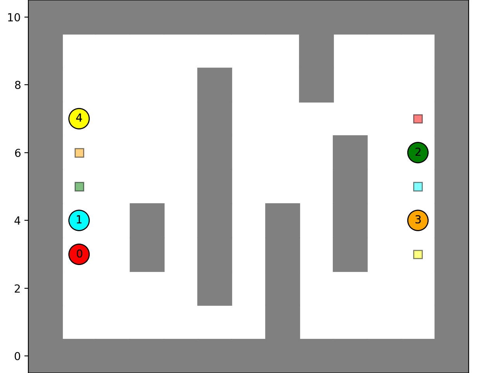
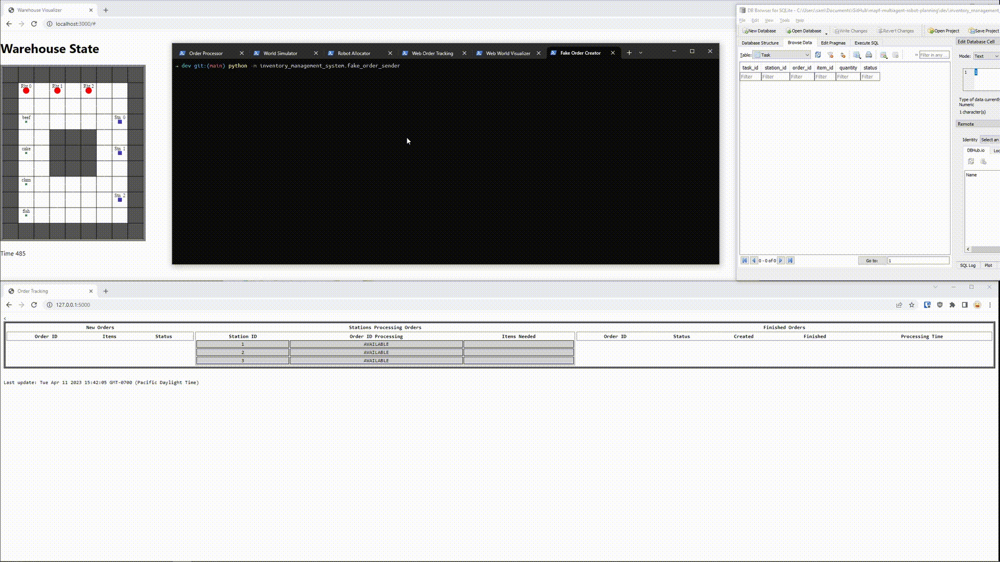

# Automated Warehouse & Multi-agent path planning

*The [wiki](https://github.com/Elucidation/mapf-multiagent-robot-planning/wiki) contains the most recent information and videos ([1K robots!](https://github.com/Elucidation/mapf-multiagent-robot-planning/assets/434925/e7c71c64-2af6-4b10-a2c1-b1b9d197078e)) on this project. [Potentially live demo on GCP](http://warehouse.tetralark.com/)*

What all goes into logistics? I explore this by building a simulated automated warehouse and the systems needed to consolidate orders with multiple agents.

We first assume a spherical cow / 2D grid world layout for the warehouse, we will have N robots that can move items from load zones to stations, 
and then a system for tracking incoming Orders and fulfilling them with those Robots. 

This breaks up into two parts, the algorithm side (MAPF) and the logistics/database side (inventory management system / automated warehouse).

https://user-images.githubusercontent.com/434925/234989748-8a36ec2a-aaec-4342-b32e-4234e35d7ee1.mp4

## Multi-Agent Path Planning (MAPF)  [`multiagent_planner`](dev/multiagent_planner/)
Building a python module for finding paths in a 2D grid world for single and multiple agents simultaneously without collisions.

## Automated Warehouse - Inventory Management System

Building a full stack warehouse inventory management system from the ground up. 

* Orders come in, which are requests for a set of items to be consolidated and shipped.
* Stations are assigned orders to fulfill, which are broken down into a series of Tasks to move Items to that station.
* The Robot Allocator takes available tasks and creates Jobs to move items from their pickup to the station, and assigns them to available Robots
* The World Simulator simulates all of this, including robots being pathed through the warehouse avoiding obstacles and each other
* A web interface shows live views of the warehouse inventory system (Orders/Stations & progress)
* Another web interface shows a live view of the simulated warehouse, with the world setup and robots current position and their paths, as well as items they hold.

The automated warehouse project utilizes a system of Orders, Tasks, and Jobs managed by a Robot Allocator, which assigns Robots to efficiently transport Items from Item Zones to Stations for assembly and order fulfillment.

### [`inventory_management_system`](dev/inventory_management_system/)

A python module for tracking creating and tracking Orders, Items, Stations, and Tasks.

###

