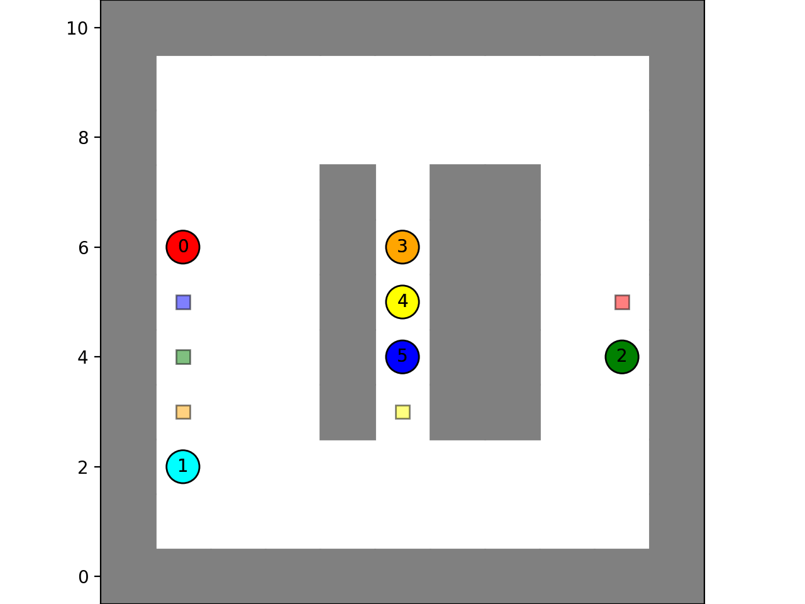

# Multi-Agent PathFinding (MAPF) for 2D Robots on a grid
Re-discovering basic MAPF (Multi-Agent Path finding) algorithms, and in the process building a simulator + visualizer + robots + planning. 

Also to give reasons for paths, might build an inventory management system with Sqlite3/MQTT etc.

**Some Concepts used:**
- Robot/Agents with move/wait actions (todo: pick/drop)
- 2D gridworld simulator with state detection
- vertex/edge collision of paths
- A* planner / Space-Time A* planner (STA*) / Conflict Based Search (CBS)
- Matplotlib live visualization + animation
- sqlite3 database inventory management
- ~~MQTT message passing using local MQTT broker~~ *No longer needed*

# Ideation

To catch up on the current state of multi-robot path planning this repo starts as a sandbox of robots in 2D grid environments pathing around walls and each other.

To create our world, we'll start with a $NxM$ 2D grid that can either be ground (open) or walls (obstructed). Robots will be points that live on this grid in a tile. We'll call this a position $(x,y)$ in graph space or $(r,c)$ in array space [note: $(x,y) == (c, r)$ ]. Robots can move from tile to tile, once per time step. 
For now let's call the combination of our 2D grid and list of current robot positions a state. A state is valid if all robots are in open tiles and no two robots are on the same tile.  (*Note: 2 robots switching positions ie. edge collision comes later*)

Then, for each robot, we'll have a $start$ position $(x_{start},y_{start})$ and a $goal$ position (x_{goal},y_{goal}). A path will be a list of positions from $start$ to $goal$. Each position is one timestep after the other, so a path of 3 positions goes from T=0 to T=2.

### Single Robot
Assuming just one robot, only wall collisions exist. For this type of world  where the grid is static and known and heuristics are simple/admissable, path planning with A* in 2D is a decent option.  
There's alternatives to consider in the future, Dijkstra variants, bi-directional A*, greedy, D* etc which have some pros/cons, but these considerations will change as soon as we add robots and change our environment up. For now, A* with it's worst case time complexity of something like  $O(b^d)$ ~ $O(4^{NM})$. 

### Multiple Robots (MAPF)
Now if we have $N$ robots we'll update our state to be the $grid$ a list of $start$ positions and a list of $goal$ positions.
To check validity of a state the same thing applies, but now we also care when two paths collide on an edge (ie between two states two robots switch position). A first pass validity check can compare pairs of states for these edge collisions, which will work for a live environment, but in the algorithm space lets get a more complete solution by expecting to have paths for all robots planned and call this combination a $solution$ which is our grid, starts, goals, and paths for all robots. 

A solution is valid if over all the paths, no two paths have a vertex (robot on other robot) or edge (robot swapping other robot) collisions, and no robot ever goes on a wall tile. 

An algorithm to find this solution given these inputs is sometimes called a Multi-Agent Path Finding (MAPF) algorithm, and there is quite a variety of them out there optimized for different use-cases. For example; multiple self-driving vehicles, drone swarms, automated warehouse order consolidation, strategy game multi-unit pathing, etc. I particularly enjoyed [David Silver's Cooperative Path Planning paper](https://www.davidsilver.uk/wp-content/uploads/2020/03/coop-path-AIWisdom.pdf) as an overview on this topic. Depending on the world (ex. grid-based/real space/3D/etc.) or knowledge (static known/unknown, fog of war, dynamic etc.) or speed (real-time, fixed, etc.) , the types of MAPF algorithms can vary. 

#### MAPF0 (independent A* per robot)
A simple/naive first-pass we'll call MAPF0 is to use A* for each robot with no knowledge of each other, just the grid. For sparse worlds/grids this isn't a problem. One could imagine a few people standing randomly on a football field, and told to go to some other random locations on the field. The likelihood of them colliding is pretty small, even if a few obstacles were places on the field. Now if that same situation happened in a cubicle office, it's very likely there'd be collisions. The big O for this would be $O(K* 4^{MN})$ where $K=\text{number of robots}$ and $MxN = \text{grid shape}$, so linear to the number of robots.
Of course, these solutions will rarely be valid in non-sparse grids. 

### MAPF1 simple Conflict-based search (CBS)
A step up from this is first to define a method to identify collisions, we'll call `find_collisions(path1, path2) -> list of collisions` where a $collision$ is a tuple containing $(\text{path index, position, time})$, Then we iterate over all path pairs to get a list of all collisions identified. 

Now in a loop, we update the paths with collisions with a new A* search that also includes this collision. Note that the collision has a time component, and naive A* doesn't use time. We want to be able to path plan with temporary obstacles that happen at certain times, a simple but computationally expensive way to do this is the expand the search space of our grid from $NxM$ into a 3rd time dimension as $NxMxT$ where each cell is an obstacle/open spot at a certain time. This naive $STA*$ algorithm [which is $O(4^{NMT})$!!] can work here since we're working with small 2D known grids for now, there will be some interesting optimizations to be had as we go further.  

So now, we have our MAPF1 algorithm, where we start with A* paths for each robot, adding these time-based (ie. dynamic) collisions between paths, and then in a loop update those paths with our STA* algorithm, using our ever expanding list of dynamic collisions.  We keep doing this until no conflicts remain, and we have a valid solution. This is close but not always optimal, as we are arbitrarily choosing which path to update, rather than trying both options in an ever expanding binary tree to get to the optimal solution (todo).

### Next / TODO
Scale up # of robots from handful to 100's, similarly scale up grid. This'll definitely require going closer to state-of-the-art in CBS etc.
Then, transition from known start/goal positions to dynamic/live, ie. new start/goals are requested during computation, call these tasks. 

Manage and allocate free robots to tasks as they come up, update MAPF# algorithms to work live, might transition to D* or alternative low-level path finding algorithms at this point

Generate tasks via inventory management system (IMS), possibly extend to ticket/order-based system with grouping/consolidation etc.

Update CBS via:
- A*/STA* use true-path heuristic
- re-org code for cleanliness (separate IMS to other folder)

### Lit Study

- [Conflict-based search for optimal multi-agent pathfinding](https://doi.org/10.1016/j.artint.2014.11.006) Guni Sharon, Roni Stern, Ariel Felner, Nathan R. Sturtevant - Artificial Intelligence, 2015
- [Multi-agent path finding with mutex propagation](https://doi.org/10.1016/j.artint.2022.103766) H Zhang, J Li, P Surynek, TKS Kumar, S Koenig - Artificial Intelligence, 2022 
- [Assignment on MAPF](http://idm-lab.org/project-p/project.html) S Koenig
- [Cooperative Path Planning](https://www.davidsilver.uk/wp-content/uploads/2020/03/coop-path-AIWisdom.pdf) David Silver
- [SIPP: Safe Interval Path Planning for Dynamic Environments](https://www.cs.cmu.edu/~maxim/files/sipp_icra11.pdf)
