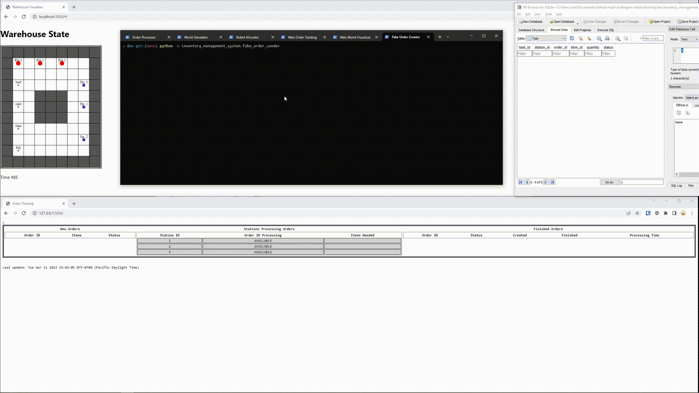
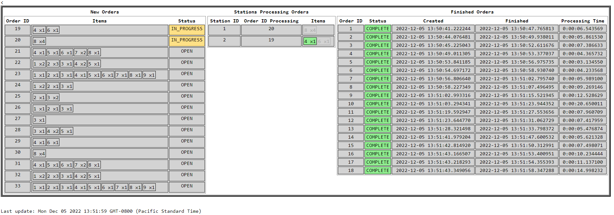
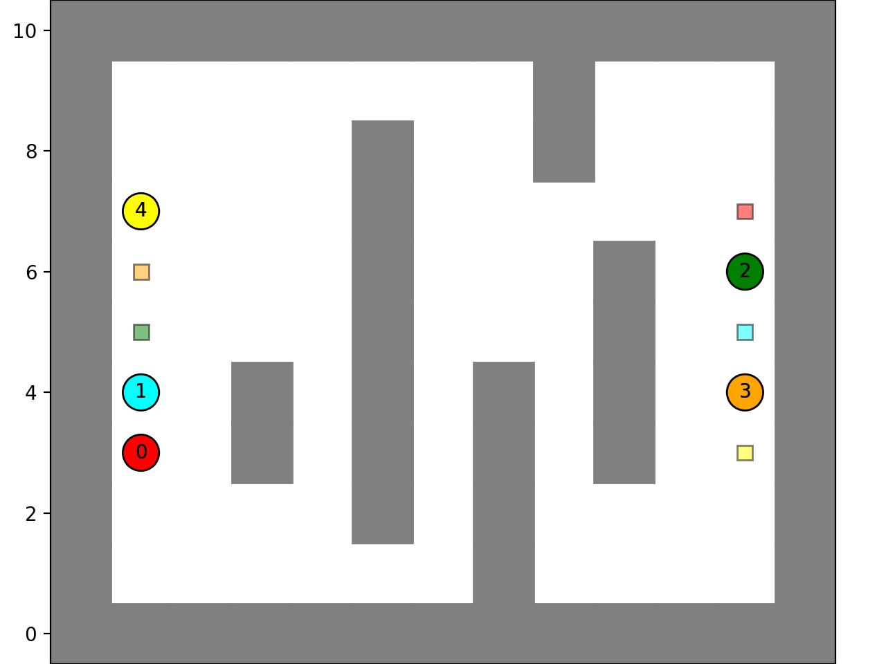

# Automated Warehouse

This folder contains development scripts testing out an automated warehouse project.

The automated warehouse project utilizes a system of Orders, Tasks, and Jobs managed by a Robot Allocator, which assigns Robots to efficiently transport Items from Item Zones to Stations for assembly and order fulfillment.



General flow of operations:


Concepts: 
* Orders are comprised of various combinations of Items that need to be picked up and assembled.
* Items are located in designated Item Zones within the Warehouse.
* Stations are responsible for processing Orders. An Order is considered complete once all its associated Items have been delivered to the Station through a series of Tasks.
* The Warehouse contains multiple Stations for gathering and assembling Items to fulfill Orders.
* Robots are responsible for transporting Items from the Item Zones to the Stations within the Warehouse.
* Tasks represent the delivery of a specified quantity of an Item to a Station.
* Each Robot is assigned a single Job, which involves moving one Item to a Station.
* The Robot Allocator generates Jobs based on outstanding Tasks and assigns them to available Robots.
* As Robots complete their Jobs, the corresponding Tasks are fulfilled, eventually leading to the completion of Orders. Once an Order is completed, the Station becomes available for a new Order.
* This process continues indefinitely as new Orders are received and processed.


Sequence diagram 


## Modules:

### [`inventory_management_system`](inventory_management_system/)
A python module for tracking creating and tracking Orders, Items, Stations, and Tasks.


### [`multiagent_planner`](multiagent_planner/)
A python module for finding paths in a 2D grid world for singular and multiple agents without collisions.


### [`env_visualizer`](env_visualizer/)
A node module for seeing a live view of the tables of Orders/Stations and their status as they get completed.


## Scripts

### [`world_sim.py`](world_sim.py)
Simulates the environment and robots.

### [`robot_allocator.py`](robot_allocator.py)
Manages Robot states and assigns Tasks to them, updating the warehouse as needed


### [`order_processor.py`]([inventory_management_system/order_processor.py])
Manages open orders, assigns to stations, creates tasks, etc.

---

- Orders with multiple items will be assigned to empty stations.
- Robots will be assigned Tasks to take items from pickup to assigned stations,
- when a station has all items in an order, the order is completed and removed from the station.
- The system runs indefinitely

# Running


Run commands from this `dev` folder.

Either use the all-in-one `start_warehouse.bat` or individually start it with the following commands.


Start order processor and reset the inventory management database:
```sh
python -m inventory_management_system.order_processor reset
```

Start the world simulator
```sh
python -m world_sim
```


Run the order/station live visualizer (Need [flask](https://flask.palletsprojects.com/en/2.2.x/installation/) installed)
```sh
flask --app inventory_management_system.order_tracking_web_server --debug run
```

Run the world (the robots, zones,etc. on a 2D grid) live visualizer
```sh
node env_visualizer
```


Create fake orders with:
```sh
python -m inventory_management_system.fake_order_sender
```

# Tests

Using the python unit testing framework.

```sh
python -m unittest
```