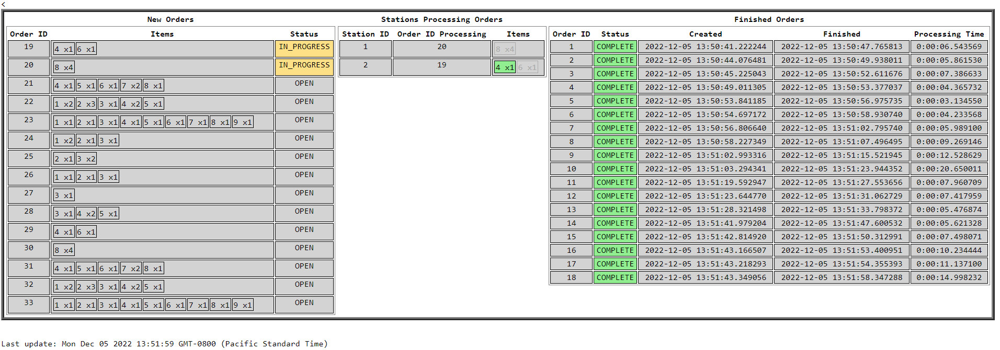

# Inventory Management System (IMS)

Prototyping of a simplified IMS system for MAPF point robots in a 2D gridworld.


*Screenshot of live web UI for tracking orders (with items and quantities), stations and completed tasks*

A Scenario has a Grid, with Robots, Robot start/wait positions, Item pickup locations, and Stations.
Orders with multiple items will be assigned to empty stations.
Robots will be assigned Tasks to take items from pickup to assigned stations, 
when a station has all items in an order, the order is completed and removed from the station.
The system runs until all orders are completed or an error occurs.

## Concepts
* Order contains Items
* Stations consolidate Orders
* Stations contain Items

When a Station contains all items for an assigned order, the Order is ready to be sent/removed.

```
TABLE Order 
order_id, created_by, creation_date, destination_id, description, state

TABLE Item
item_id, item_title, item_description, item_color

TABLE OrderItem
order_id, item_id, quantity


TABLE Station
station_id, station_xy, state

TABLE StationOrder
station_id, order_id

TABLE StationItem
station_id, item_id
```

## Flow

Order Request -> MQTT -> order_mqtt_to_db -> DB insert new open order 

DB -> get open orders oldest N -> assign open order to empty station -> DB insert order-station

DB -> get stations with unfinished orders (missing items) -> assign [item-start->station] tasks for robots -> DB insert tasks

DB -> get available tasks for robots oldest N -> assign tasks to available robots -> update DB