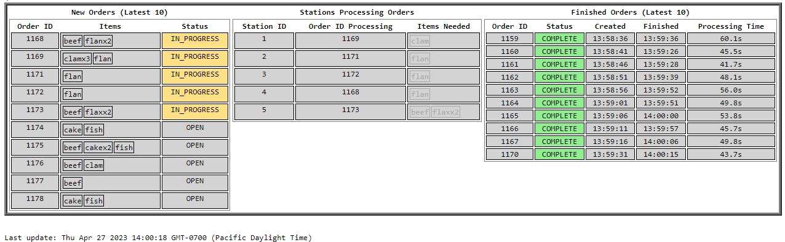

# Inventory Management System (IMS)

Prototyping of a simplified IMS system for MAPF point robots in a 2D gridworld.


*Screenshot of live web UI for tracking orders (with items and quantities), stations and completed tasks*

A Scenario has a Grid, with Robots, Robot start/wait positions, Item pickup locations, and Stations.
Orders with multiple items will be assigned to empty stations.
Robots will be assigned Tasks to take items from pickup to assigned stations,
when a station has all items in an order, the order is completed and removed from the station.
The system runs until all orders are completed or an error occurs.

## Concepts

This system allows you to manage orders that consist of multiple items, track the items and tasks at different assembly stations, and monitor the progress of each order.

The IMS Database is a system to manage orders, items, and tasks in a production or assembly environment. Here's a simple explanation of each table:

1. `Order` table: Stores information about orders, including an order ID, who created it, when it was created, when it was finished, a description, and the order status.

2. `Item` table: Stores information about individual items, including an item ID, name, description, and color.

3. `OrderItem` table: Represents the relationship between orders and items. It shows which items are part of an order and the quantity of each item in the order.

4. `Station` table: Stores information about workstations or assembly stations, including a station ID and the order currently being processed at the station.

5. `Task` table: Stores information about tasks associated with processing an order at a specific station. It includes a task ID, station ID, order ID, item ID, quantity, and task status.

* Order contains Items
* Stations consolidate Orders
* Tasks are to add Items to a Station

When a Station contains all items for an assigned order, the Order is ready to be sent/removed.
Assigning an Order to a Station marks the order `IN_PROGRESS`,
adds Tasks for each item in the order to that station, and assigns the order id to that station.

```sql
TABLE Order
order_id, created_by, created, finished, description, status

TABLE Item
item_id, name, description, color

TABLE OrderItem
order_id, item_id, quantity

TABLE Station
station_id, order_id

TABLE Task
task_id, station_id, order_id, item_id, quantity, status
```

## Flow

Order Request -> MQTT -> order_mqtt_to_db -> DB insert new open order

DB -> get open orders oldest N -> assign open order to empty station -> DB insert order-station + tasks for all items to station

DB -> get available tasks for robots oldest N -> assign tasks to available robots -> update DB

on task complete -> check DB if station has no tasks (ie. complete) -> complete order on DB
